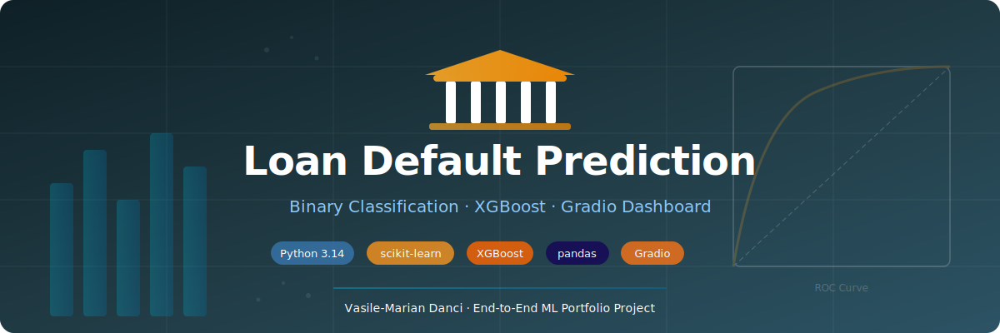
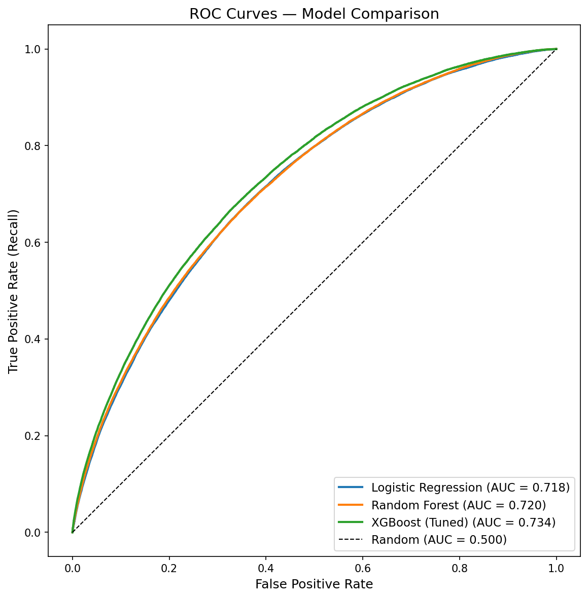
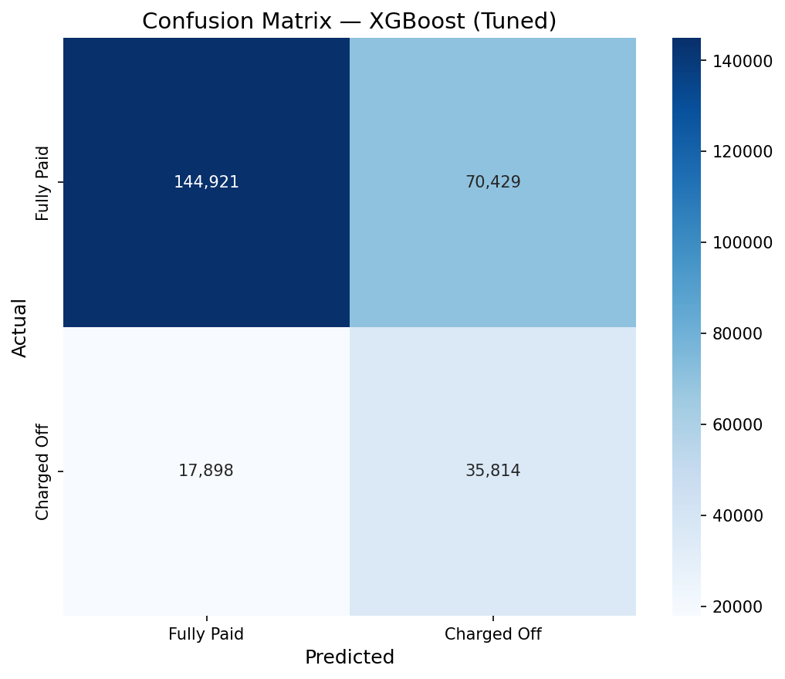

# 🏦 Loan Default Prediction

<p align="center">
  
</p>

> Binary classification model predicting whether a LendingClub loan will
> **default** (Charged Off) or be **Fully Paid**, using borrower and loan
> characteristics available at origination time.


---

## 📌 Overview

This end-to-end machine learning project follows a structured 8-phase workflow
(documented in the [learning guideline](guideline.md)) covering everything from
data loading through model deployment:

1. **Data loading** with memory optimization (2.2M rows, 150 columns)
2. **Exploratory Data Analysis** — class balance, missing values, leakage detection, temporal trends
3. **Feature engineering** — domain-driven feature creation + sklearn Pipeline
4. **Model training** — Logistic Regression → Random Forest → XGBoost
5. **Hyperparameter tuning** — RandomizedSearchCV (30 iterations × 3 folds)
6. **Evaluation** — ROC, Precision-Recall, Confusion Matrix, Feature Importances
7. **Deployment** — interactive Gradio dashboard with real-time predictions
8. **Documentation** — data dictionary, README, reproducibility checklist

---

## 📁 Project Structure

```
loan_default_prediction/
├── guideline.md                        # Paint-by-numbers learning guide (47 TODOs)
├── README.md
│
├── data/
│   ├── .gitkeep
│   ├── accepted_2007_to_2018Q4.csv.gz  # ⚠️ gitignored — download from Kaggle (see below)
│   └── rejected_2007_to_2018Q4.csv.gz  # ⚠️ gitignored — not used in this project
├── docs/
│   └── data-dictionary.md              # 📋 created in Phase 8 (TODO 8.1)
├── models/
│   ├── .gitkeep
│   ├── xgboost_tuned.pkl               # ⚠️ gitignored — generated by train.py
│   └── results.csv                     # ⚠️ gitignored — generated by train.py
├── notebooks/
│   └── exploration.ipynb               # EDA notebook (Phase 1 & 2)
├── reports/
│   └── figures/
│       ├── .gitkeep
│       ├── cover.svg                   # Project banner image
│       ├── pipeline_map.svg            # 8-phase pipeline diagram
│       ├── roc_curves.png              # ⚠️ gitignored — generated by train.py
│       ├── confusion_matrix_*.png      # ⚠️ gitignored — generated by train.py
│       └── feature_importances.png     # ⚠️ gitignored — generated by train.py
├── src/
│   └── train.py                        # Training pipeline (Phase 3–6)
├── todos/                              # Phase-by-phase learning guides
│   ├── phase1_config_and_loading.md
│   ├── phase2_eda.md
│   ├── phase3_feature_engineering.md
│   ├── phase4_model_training.md
│   ├── phase5_hyperparameter_tuning.md
│   ├── phase6_evaluation.md
│   ├── phase7_gradio.md
│   └── phase8_documentation.md
└── app.py                              # 📋 created in Phase 7 (TODO 7.2)
```

> **⚠️ gitignored** = not uploaded to GitHub. Datasets (`.csv.gz`), model artifacts (`.pkl`),
> and generated figures (`.png`) are excluded via [.gitignore](../.gitignore) because they're
> large and reproducible. Download the dataset from Kaggle and regenerate artifacts with `python src/train.py`.

---

## 📊 Dataset

| Property | Value |
|----------|-------|
| **Source** | [LendingClub on Kaggle](https://www.kaggle.com/datasets/wordsforthewise/lending-club) (accepted loans, 2007–2018 Q4) |
| **Download** | [📥 Download from Kaggle](https://www.kaggle.com/datasets/wordsforthewise/lending-club) → place `accepted_2007_to_2018Q4.csv.gz` in `data/` |
| **Raw size** | ~2.2M loans × 150 columns |
| **After filtering** | Fully Paid + Charged Off only (known outcomes) |
| **Target** | `loan_status` → 0 (Fully Paid) / 1 (Charged Off) |
| **Class balance** | ~80% Fully Paid / ~20% Charged Off |

---

## 🔬 Workflow

### 1. Exploratory Data Analysis
> `notebooks/exploration.ipynb`

- Visualized class imbalance, feature distributions, and temporal trends
- Identified and flagged **data leakage** columns (post-origination features)
- Analyzed default rates by grade, term, purpose, home ownership
- Mapped missing data and determined drop/impute thresholds

### 2. Feature Engineering & Preprocessing
> `src/train.py`

- Dropped leakage, ID, free-text, and high-missing columns
- Engineered 5 new features from domain knowledge:
  `term_months`, `emp_years`, `credit_history_years`, `income_to_loan`, `installment_to_income`
- Built sklearn `Pipeline` with `ColumnTransformer`:
  - Numeric: median imputation → standard scaling
  - Ordinal (grade): ordinal encoding (A=0 → G=6)
  - Nominal: mode imputation → one-hot encoding (max 15 categories)

### 3. Model Training & Tuning

| Model | Accuracy | Precision | Recall | F1 | ROC-AUC |
|-------|----------|-----------|--------|-----|---------|
| Logistic Regression | 0.6627 | 0.3270 | 0.6516 | 0.4355 | 0.7179 |
| Random Forest | 0.6664 | 0.3289 | 0.6450 | 0.4357 | 0.7199 |
| XGBoost (default) | 0.6639 | 0.3320 | 0.6759 | 0.4453 | 0.7329 |
| **XGBoost (tuned)** | **0.6717** | **0.3371** | **0.6668** | **0.4478** | **0.7342** |

> Fill in from `models/results.csv` after running `python src/train.py`

### 4. Deployment
> `app.py`

Interactive Gradio dashboard with:
- Input form for loan & borrower parameters
- Real-time default probability prediction with confidence display
- Model performance tab showing metrics and figures

---

## 📈 Key Results

<p align="center">
  
  
</p>

> The tuned XGBoost model achieves **0.7342 ROC-AUC** with **66.7% recall** on defaults,
> balancing the trade-off between catching risky loans and not rejecting too many good ones.
> `grade`, `sub_grade`, and `term_months` are the top predictive features.

---

## 🛠️ Tech Stack

| Category | Tools |
|----------|-------|
| **Language** | Python 3.14 |
| **ML** | scikit-learn, XGBoost |
| **Data** | pandas, NumPy, SciPy |
| **Visualization** | matplotlib, seaborn |
| **Dashboard** | Gradio |
| **Environment** | uv (dependency management) |

---

## 🚀 Getting Started

```bash
# Clone and setup
git clone https://github.com/DanciVasile/data-science-projects.git
cd data-science-projects
.\init.ps1  # creates .venv, installs dependencies, registers Jupyter kernel

# Run EDA notebook
cd loan_default_prediction
jupyter notebook notebooks/exploration.ipynb

# Train models (generates figures + saves model)
python src/train.py

# Launch dashboard
python app.py
```

---

## 📝 Key Design Decisions

1. **Accepted loans only** — rejected loans lack outcome data and have a different schema
2. **Fully Paid vs Charged Off** — dropped in-progress statuses for a clean binary signal
3. **Class weighting over SMOTE** — with 400k+ defaults, synthetic oversampling is unnecessary
4. **Stratified random split** — 80/20 train/test with preserved class proportions
5. **Leakage prevention** — removed all post-origination features (payment history, recovery amounts, last FICO) to ensure realistic evaluation
6. **PNG figures** — compatible with both GitHub README rendering and Gradio `gr.Image()`

---

## 📖 Learning Guide

This project includes a detailed **paint-by-numbers learning guide** with 47 TODOs
across 8 phases. See [guideline.md](guideline.md) for the master roadmap and the
[todos/](todos/) folder for step-by-step instructions with code, explanations,
and concept tables.

---

<p align="center">
  Made with ❤️ by <strong>Vasile-Marian Danci</strong>
  <br/><br/>
  <a href="https://github.com/DanciVasile">
    
  </a>
  &nbsp;
  <a href="https://www.linkedin.com/in/vasile-danci-m/">
    
  </a>
</p>
