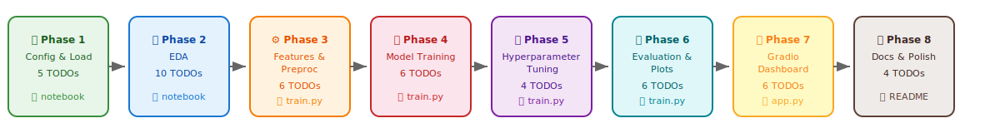

# 🎨 Loan Default Prediction — Learning Guideline

> **A paint-by-numbers guide to building an end-to-end ML project.**
>
> Each phase is a "section" of the painting. Each TODO is a numbered area.
> Follow them in order, check the boxes as you go, and by the end
> you'll have a complete, portfolio-ready data science project.

---

## 🗺️ The Map

> **Total: 47 TODOs across 8 phases · Estimated time: 17–26 hours**

---

## 📋 Phase-by-Phase TODO Tracker

### Phase 1 — Configuration & Data Loading
> 📄 **Guide:** [todos/phase1_config_and_loading.md](todos/phase1_config_and_loading.md)
> 📍 **Where:** `notebooks/exploration.ipynb` — Sections 1–3 (Imports, Config, Load Data)
> 🎯 **Goal:** Get data into Python, correctly configured, memory-optimized

| # | TODO | Status |
|---|------|--------|
| 1.1 | Update Configuration Cell (`TARGET_COL`, `TASK`) | - [ ] |
| 1.2 | Load Data with Memory Optimization | - [ ] |
| 1.3 | Binarize Target Column (Fully Paid → 0, Charged Off → 1) | - [ ] |
| 1.4 | Create Stratified Sample (200k rows) for EDA | - [ ] |
| 1.5 | Run Data Quality Summary Card | - [ ] |

**Key skills learned:** `pd.read_csv`, dtype downcasting, `.map()`, stratified sampling

---

### Phase 2 — Exploratory Data Analysis
> 📄 **Guide:** [todos/phase2_eda.md](todos/phase2_eda.md)
> 📍 **Where:** `notebooks/exploration.ipynb` — Sections 4–10 (Target, Missing, Cleaning, EDA)
> 🎯 **Goal:** Understand the data deeply before modeling

| # | TODO | Status |
|---|------|--------|
| 2.1 | Target Variable Distribution (class balance) | - [ ] |
| 2.2 | Missing Values Analysis (drop / impute / ignore) | - [ ] |
| 2.3 | Identify Leakage Columns (⚠️ critical!) | - [ ] |
| 2.4 | Data Cleaning (drop IDs, text, leakage, high-missing) | - [ ] |
| 2.5 | Univariate Analysis (histograms, bar charts) | - [ ] |
| 2.6 | Default Rate by Categorical Features | - [ ] |
| 2.7 | Correlation Analysis & Box Plots | - [ ] |
| 2.8 | Temporal Analysis (default rate over time) | - [ ] |
| 2.9 | Outlier Detection (IQR method) | - [ ] |
| 2.10 | Fill in EDA Summary with Findings | - [ ] |

**Key skills learned:** `.value_counts()`, `.corr()`, `.groupby().mean()`, `seaborn`, data leakage awareness

---

### Phase 3 — Feature Engineering & Preprocessing
> 📄 **Guide:** [todos/phase3_feature_engineering.md](todos/phase3_feature_engineering.md)
> 📍 **Where:** `src/train.py` (create this file)
> 🎯 **Goal:** Transform raw data into model-ready features

| # | TODO | Status |
|---|------|--------|
| 3.1 | Create `src/train.py` Scaffold | - [ ] |
| 3.2 | `load_data()` — Load CSV & Binarize Target | - [ ] |
| 3.3 | `drop_columns()` — Remove Leakage, IDs, Junk | - [ ] |
| 3.4 | `engineer_features()` — Create New Features | - [ ] |
| 3.5 | `build_preprocessor()` — Sklearn ColumnTransformer | - [ ] |
| 3.6 | `split_data()` — Train/Test Split | - [ ] |

**Key skills learned:** `Pipeline`, `ColumnTransformer`, `OrdinalEncoder`, `OneHotEncoder`, `StandardScaler`

---

### Phase 4 — Model Training
> 📄 **Guide:** [todos/phase4_model_training.md](todos/phase4_model_training.md)
> 📍 **Where:** `src/train.py` (add training functions)
> 🎯 **Goal:** Train baseline through advanced models, compare performance

| # | TODO | Status |
|---|------|--------|
| 4.1 | Understand Class Imbalance Handling | - [ ] |
| 4.2 | `evaluate_model()` — Standardized Evaluation Helper | - [ ] |
| 4.3 | Train Logistic Regression (Baseline) | - [ ] |
| 4.4 | Train Random Forest | - [ ] |
| 4.5 | Train XGBoost | - [ ] |
| 4.6 | Model Comparison Table | - [ ] |

**Key skills learned:** `LogisticRegression`, `RandomForestClassifier`, `XGBClassifier`, `cross_val_score`, `class_weight="balanced"`

---

### Phase 5 — Hyperparameter Tuning
> 📄 **Guide:** [todos/phase5_hyperparameter_tuning.md](todos/phase5_hyperparameter_tuning.md)
> 📍 **Where:** `src/train.py` (add tuning function)
> 🎯 **Goal:** Squeeze out the best performance from the best model

| # | TODO | Status |
|---|------|--------|
| 5.1 | Understand the Search Space | - [ ] |
| 5.2 | Implement `tune_xgboost()` with RandomizedSearchCV | - [ ] |
| 5.3 | Save the Best Model to `models/` | - [ ] |
| 5.4 | (Optional) Bayesian Optimization with Optuna | - [ ] |

**Key skills learned:** `RandomizedSearchCV`, `scipy.stats` distributions, `joblib.dump`, overfitting detection

---

### Phase 6 — Evaluation & Visualization
> 📄 **Guide:** [todos/phase6_evaluation.md](todos/phase6_evaluation.md)
> 📍 **Where:** `src/train.py` (add plotting functions)
> 🎯 **Goal:** Visualize model performance for the README and dashboard

| # | TODO | Status |
|---|------|--------|
| 6.1 | Plot ROC Curves (all models) | - [ ] |
| 6.2 | Plot Precision-Recall Curves | - [ ] |
| 6.3 | Plot Confusion Matrix | - [ ] |
| 6.4 | Plot Feature Importances (Top 20) | - [ ] |
| 6.5 | Print Classification Report | - [ ] |
| 6.6 | Wire All Figures into `main()` | - [ ] |

**Key skills learned:** `roc_curve`, `confusion_matrix`, `classification_report`, `precision_recall_curve`

---

### Phase 7 — Gradio Dashboard
> 📄 **Guide:** [todos/phase7_gradio.md](todos/phase7_gradio.md)
> 📍 **Where:** `app.py` (create this file)
> 🎯 **Goal:** Make the model interactive and deployable

| # | TODO | Status |
|---|------|--------|
| 7.1 | Verify Gradio Installation | - [ ] |
| 7.2 | Create `app.py` Skeleton | - [ ] |
| 7.3 | Build the Prediction Function | - [ ] |
| 7.4 | Build the UI with `gr.Blocks` | - [ ] |
| 7.5 | Add Model Performance Tab | - [ ] |
| 7.6 | Launch & Final Testing (3 scenarios) | - [ ] |

**Key skills learned:** `gradio`, `gr.Blocks`, `gr.Number`, `gr.Dropdown`, `gr.Slider`, `gr.Label`

---

### Phase 8 — Documentation & Polish
> 📄 **Guide:** [todos/phase8_documentation.md](todos/phase8_documentation.md)
> 📍 **Where:** `README.md`, `docs/data-dictionary.md`
> 🎯 **Goal:** Make the project recruiter-ready

| # | TODO | Status |
|---|------|--------|
| 8.1 | Write Data Dictionary (`docs/data-dictionary.md`) | - [ ] |
| 8.2 | Write Project README with Results | - [ ] |
| 8.3 | Update Root README | - [ ] |
| 8.4 | Final Verification Checklist | - [ ] |

**Key skills learned:** Technical writing, project documentation, reproducibility

---

## 🧰 Tools & Functions Reference

### Data Loading & Manipulation
| Function | Package | Purpose |
|----------|---------|---------|
| `pd.read_csv()` | pandas | Read CSV/compressed files |
| `df.select_dtypes()` | pandas | Filter columns by data type |
| `df.groupby().agg()` | pandas | Aggregate statistics by group |
| `df.isnull().mean()` | pandas | Missing data fraction per column |
| `pd.to_datetime()` | pandas | Parse date strings |
| `pd.to_numeric(downcast=)` | pandas | Reduce numeric precision |

### Visualization
| Function | Package | Purpose |
|----------|---------|---------|
| `plt.subplots()` | matplotlib | Create figure with subplot grid |
| `sns.heatmap()` | seaborn | Correlation matrix, confusion matrix |
| `sns.boxplot()` | seaborn | Distribution by category |
| `ax.barh()` | matplotlib | Horizontal bar chart |
| `ax.twinx()` | matplotlib | Dual y-axis |

### Preprocessing
| Class | Package | Purpose |
|-------|---------|---------|
| `Pipeline` | sklearn | Chain transformations |
| `ColumnTransformer` | sklearn | Apply different transforms to different columns |
| `SimpleImputer` | sklearn | Fill missing values |
| `StandardScaler` | sklearn | Normalize to mean=0, std=1 |
| `OneHotEncoder` | sklearn | Binary encoding for nominal categories |
| `OrdinalEncoder` | sklearn | Integer encoding preserving order |

### Model Training
| Class | Package | Purpose |
|-------|---------|---------|
| `LogisticRegression` | sklearn | Linear binary classifier |
| `RandomForestClassifier` | sklearn | Ensemble of decision trees |
| `XGBClassifier` | xgboost | Gradient-boosted trees |
| `StratifiedKFold` | sklearn | Cross-validation preserving class balance |
| `cross_val_score` | sklearn | Evaluate model with cross-validation |
| `RandomizedSearchCV` | sklearn | Hyperparameter tuning |

### Evaluation
| Function | Package | Purpose |
|----------|---------|---------|
| `roc_auc_score()` | sklearn | Area under ROC curve |
| `roc_curve()` | sklearn | FPR, TPR at every threshold |
| `precision_recall_curve()` | sklearn | Precision, Recall at every threshold |
| `confusion_matrix()` | sklearn | 2×2 prediction breakdown |
| `classification_report()` | sklearn | Per-class precision, recall, F1 |
| `f1_score()` | sklearn | Harmonic mean of precision and recall |

### Deployment & I/O
| Function | Package | Purpose |
|----------|---------|---------|
| `joblib.dump()` | joblib | Save model to file |
| `joblib.load()` | joblib | Load model from file |
| `gr.Blocks()` | gradio | Full-control dashboard layout |
| `gr.Number()` / `gr.Slider()` | gradio | Numeric input widgets |
| `gr.Dropdown()` | gradio | Single-choice selector |
| `gr.Label()` | gradio | Classification result with confidence |
| `gr.Tabs()` / `gr.Tab()` | gradio | Tabbed layout |

---

## 📐 Project Conventions

These conventions are shared across all projects in this repo:

| Convention | Description |
|------------|-------------|
| `X` = features, `y` = target | Standard ML naming (from $y = f(X) + \varepsilon$) |
| `TARGET_COL` | String name of the target column |
| `TASK` | `"classification"` or `"regression"` |
| `numeric_features` / `categorical_features` | Column lists split by dtype |
| `df_sample` | Stratified subsample for EDA visualizations |
| `PROJECT_DIR` | Auto-resolved project root |
| `RANDOM_STATE = 42` | Reproducibility seed |
| Notebook = EDA, `train.py` = Pipeline | Separation of interactive exploration and reproducible training |
| Models → `models/`, Figures → `reports/figures/` | Artifact storage paths |

---

## ⏱️ Estimated Time

| Phase | Difficulty | Estimated Time |
|-------|-----------|---------------|
| Phase 1 — Config & Loading | 🟢 Easy | 1–2 hours |
| Phase 2 — EDA | 🟡 Medium | 3–5 hours |
| Phase 3 — Feature Engineering | 🟡 Medium | 3–4 hours |
| Phase 4 — Model Training | 🟡 Medium | 3–4 hours (plus compute time) |
| Phase 5 — Hyperparameter Tuning | 🟠 Harder | 2–3 hours (plus long compute time) |
| Phase 6 — Evaluation | 🟢 Easy | 1–2 hours |
| Phase 7 — Gradio Dashboard | 🟡 Medium | 3–4 hours |
| Phase 8 — Documentation | 🟢 Easy | 1–2 hours |
| **Total** | | **~17–26 hours** |

---

## 💡 Tips

1. **Don't rush.** It's better to understand *why* you do something than to just
   copy-paste code. Each TODO explains the "why."

2. **Run cells one at a time.** Read the output. Does it make sense?

3. **If something breaks, read the error message.** 90% of the time, the answer
   is in the traceback.

4. **Google is your friend.** `"pandas groupby mean"`, `"sklearn Pipeline tutorial"`,
   `"XGBoost class_weight"` — you'll find Stack Overflow answers for everything.

5. **Commit after each phase.** Use descriptive messages:
   - `feat: Phase 1 — data loading and config`
   - `feat: Phase 2 — EDA complete`
   - `feat: Phase 3 — feature engineering pipeline`
   - etc.

6. **The leakage check (TODO 2.3) is the most important TODO.** If you skip it
   and include post-origination features, your model will show 99% accuracy that
   means absolutely nothing. Every LendingClub project on GitHub that shows >95%
   accuracy probably has leakage.

7. **Have fun with the Gradio dashboard.** It's the most visually rewarding part.
